# 🌍✨ Language Exchange Platform - Chat & Video Calling App  
  
<div align="center">  
    
  
  
  
  
  
  
*Connect, Learn, and Practice Languages Together* 🗣️💬  
  
</div>  
  
---  
  
## 🎯 **What is this Project?**  
  
This is a **comprehensive language exchange platform** that connects language learners from around the world. Users can practice languages through real-time messaging and video calls, making language learning interactive and engaging! [0-cite-0](#0-cite-0)   
  
### ✨ **Key Features**  
  
🌐 **Real-time Messaging** - Chat with typing indicators and reactions    
📹 **Video & Voice Calls** - 1-on-1 and group video calls with screen sharing    
🔐 **Secure Authentication** - JWT-based user authentication system    
👥 **Friend System** - Send and receive friend requests    
🌍 **Language Exchange** - Match with speakers of your target language    
🎨 **32 Beautiful Themes** - Customize your experience    
📱 **Responsive Design** - Works perfectly on all devices [0-cite-1](#0-cite-1)   
  
---  
  
## 🏗️ **Project Architecture**  

```mermaid  
graph TB  
    A["👤 User"] --> B["🌐 Frontend (React)"]  
    B --> C["🔗 API Layer (Express)"]  
    C --> D["🗄️ Database (MongoDB)"]  
    C --> E["💬 Stream Chat API"]  
    C --> F["📹 Stream Video API"]  
    B --> E  
    B --> F  
      
    subgraph "Frontend Stack"  
        B1["⚛️ React 19"]  
        B2["⚡ Vite"]  
        B3["🎨 TailwindCSS + DaisyUI"]  
        B4["🔄 React Router"]  
        B5["📊 TanStack Query"]  
        B6["🧠 Zustand"]  
    end  
      
    subgraph "Backend Stack"  
        C1["🚀 Node.js + Express"]  
        C2["🔐 JWT Authentication"]  
        C3["🍪 Cookie Parser"]  
        C4["📁 Multer (File Upload)"]  
        C5["🔒 Bcrypt"]  
    end  
```
  

[0-cite-2](#0-cite-2) [0-cite-3](#0-cite-3)   
  
---  
  
## 🚀 **How to Get Started**  
  
### 📋 **Prerequisites**  
  
Before you begin, ensure you have:  
- **Node.js** (v16 or higher)  
- **MongoDB** (local or cloud instance)  
- **Stream Account** (for chat and video features)  
  
### ⚙️ **Environment Setup**  
  
#### 1. Backend Configuration (`/backend/.env`) [0-cite-4](#0-cite-4)   
  
```env  
PORT=5001  
MONGO_URI=your_mongodb_connection_string  
STEAM_API_KEY=your_stream_api_key  
STEAM_API_SECRET=your_stream_api_secret  
JWT_SECRET_KEY=your_jwt_secret_key  
NODE_ENV=development  
```  
  
#### 2. Frontend Configuration (`/frontend/.env`) [0-cite-5](#0-cite-5)   
  
```env  
VITE_STREAM_API_KEY=your_stream_api_key  
```  
  
### 🔧 **Installation & Running**  
  
#### **Step 1: Clone the Repository**  
```bash  
git clone https://github.com/letera1/Group-17-Insa-Team-Project.git  
cd Group-17-Insa-Team-Project  
```  
  
#### **Step 2: Setup Backend**  
```bash  
cd backend  
npm install  
npm run dev  
```
[0-cite-6](#0-cite-6)   
  
#### **Step 3: Setup Frontend**  
```bash  
cd frontend  
npm install  
npm run dev  
```
[0-cite-7](#0-cite-7)   
  
#### **Step 4: Access the Application**  
- 🌐 **Frontend**: http://localhost:5173  
- 🔧 **Backend**: http://localhost:5001 [0-cite-8](#0-cite-8)   
  
---  
  
## 🎮 **How the Application Works**  
  
### 📱 **User Journey Flow**  

```mermaid  
graph LR  
    A["📝 Sign Up"] --> B["✉️ Email Verification"]  
    B --> C["🚀 Onboarding"]  
    C --> D["🏠 Home Dashboard"]  
    D --> E["👥 Find Language Partners"]  
    E --> F["💬 Start Chatting"]  
    F --> G["📹 Video Call"]  
      
    D --> H["👤 Manage Profile"]  
    D --> I["🔔 Notifications"]  
    D --> J["⚙️ Settings"]  
```  
  

  
### 🔐 **Authentication System**  
  
The app uses a secure JWT-based authentication system: [0-cite-9](#0-cite-9)   
  
1. **Sign Up/Login** - Users create accounts with email and password  
2. **Password Hashing** - Passwords are securely hashed using bcrypt  
3. **JWT Tokens** - Secure tokens stored in HTTP-only cookies  
4. **Protected Routes** - Authenticated routes for secure access [0-cite-10](#0-cite-10)   
  
### 🌍 **Language Exchange Features**  
  
Users can set up their language learning profile: [0-cite-11](#0-cite-11)   
  
- **Native Language** - Your mother tongue  
- **Learning Language** - Language you want to practice  
- **Location** - Connect with nearby users  
- **Bio** - Tell others about yourself  
  
### 📊 **Application Routes** [0-cite-12](#0-cite-12)   
  
| Route | Purpose | Authentication Required |  
|-------|---------|------------------------|  
| `/` | Home Dashboard | ✅ |  
| `/signup` | User Registration | ❌ |  
| `/login` | User Login | ❌ |  
| `/onboarding` | Profile Setup | ✅ |  
| `/friends` | Friend Management | ✅ |  
| `/chat/:id` | Chat Interface | ✅ |  
| `/call/:id` | Video Call | ✅ |  
| `/notifications` | User Notifications | ✅ |  
  
---  
  
## 🛠️ **Technical Implementation**  
  
### **Backend Architecture** [0-cite-13](#0-cite-13)   
  
The backend is organized into:  
- **Controllers** - Handle business logic  
- **Models** - Database schemas (User, FriendRequest)  
- **Routes** - API endpoints (auth, users, chat, uploads)  
- **Middleware** - Authentication and validation  
- **Library** - Database connection and utilities  
  
### **Frontend Structure** [0-cite-14](#0-cite-14)   
  
The frontend follows a clean architecture:  
- **Components** - Reusable UI components  
- **Pages** - Route-specific components  
- **Hooks** - Custom React hooks  
- **Store** - Zustand state management  
- **Constants** - Configuration and constants  
  
### **Real-time Features**  
  
The app integrates Stream.io for:  
- **Chat Functionality** - Real-time messaging with typing indicators  
- **Video Calls** - High-quality video/audio calls with screen sharing  
- **Notifications** - Real-time push notifications [0-cite-15](#0-cite-15) [0-cite-16](#0-cite-16)   
  
---  
  
## 🎨 **UI/UX Features**  
  
### **Theme System**  
- 32 beautiful pre-built themes  
- Dark/Light mode support  
- Responsive design for all devices  
  
### **Modern Stack**  
- **TailwindCSS** - Utility-first CSS framework  
- **DaisyUI** - Beautiful component library  
- **Lucide React** - Modern icon system [0-cite-17](#0-cite-17)   
  
---  
  
## 📦 **Build for Production**  
  
### **Frontend Build**  
```bash  
cd frontend  
npm run build  
```  
  
### **Production Deployment**  
The app is configured for production deployment with static file serving: [0-cite-18](#0-cite-18)   
  
---  
  
## 🤝 **Contributing**  
  
We welcome contributions! Here's how you can help:  
  
1. 🍴 **Fork** the repository  
2. 🌟 **Create** a feature branch (`git checkout -b feature/AmazingFeature`)  
3. 💾 **Commit** your changes (`git commit -m 'Add some AmazingFeature'`)  
4. 🚀 **Push** to the branch (`git push origin feature/AmazingFeature`)  
5. 🔃 **Open** a Pull Request  
  
---  
  
## 📄 **License**  
  
This project is open source and available under the [MIT License](LICENSE).  
  
---  
  
## 🌟 **Show Your Support**  
  
If you like this project, please ⭐ star this repository and share it with others!  
  
---  
  
<div align="center">  
  
**Made by Group 17 INSA Team**  
  
*Connecting Language Learners Worldwide* 🌍 
  
</div>  
  
